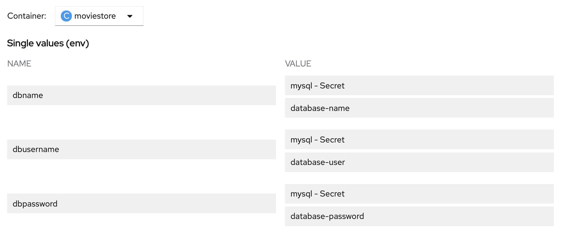

# Basic Movie Store like Netflix using data from MovieLens.
## Features:
* Top Trending Movies
* Movie Recommendations based on your recent history.
* Rate a Movie
* Filter based on Genre

** Note: This is just a sample project, we do not have any real movies in here. A gif will be played when you click to watch a movie :) Sorry to disappoint you :P :D


## Steps to deploy on Openshift:
### Setting up Database
* Install Mysql from catalog. You can use defaults or your own credentials.
* Next from inside the Mysql pod, dump the mysql code from [here](https://raw.githubusercontent.com/hanvitha/moviestore/master/Dump20191102.sql)
```bash
curl https://raw.githubusercontent.com/hanvitha/moviestore/master/Dump20191102.sql -o dump.sql

mysql -u root < dump.sql
```
Verify whether its done right:
```bash
mysql -u root
use msdb;
select * from movies limit 10;
```
If everything went well, you should see the list of movies as output.

### Deploying the Flask app
* From Catalog select from Git and deploy the app from https://github.com/hanvitha/moviestore.git. Make sure you set environment variables from advanced settings or after deployment from Deployment tab like below.




Once deployed, the moviestore application will be ready to use. 

Login or signup.
We do have around 500 users already, so you can use: user<1-500>@gmail.com
password: pass


### To demo:
*Optional- 
* First open jupyter hub and clone the project. 
* Open Movie Recommender Systems.ipynb.
* Talk about the different recommendation systems and approaches.
*Actual Needed
* Show this portal to show the approaches in live.
* This showcases the benefit of having a collaborative environment where Datascientists/Developers can work with the data and share the code with App dev
* App dev can test and deploy in same environment.


Thanks for stopping by! :) 
